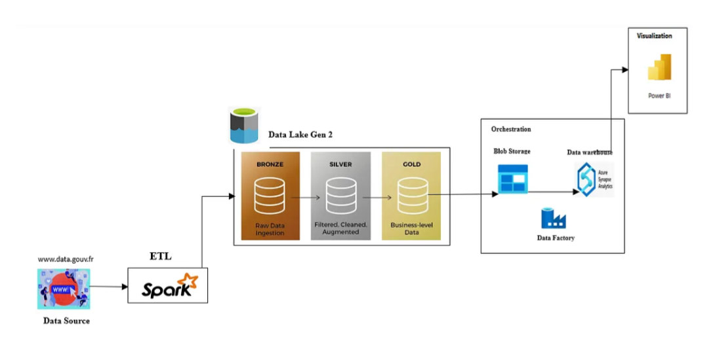

# RealEstate-Insight-Platform

## 🚀 Introduction
Dans un monde où la gestion et l'analyse des données sont devenues cruciales, disposer d'une infrastructure fiable et bien structurée est un atout majeur. Ce projet met en place une architecture Big Data complète, inspirée de l’architecture Médaillon, pour le traitement et l'analyse des transactions immobilières en France.

L’objectif est de :
✅ Ingestion des données ouvertes sur les transactions immobilières.
✅ Transformation et nettoyage des données via des pipelines ETL.
✅ Stockage structuré dans un Data Warehouse.
✅ Analyse et visualisation des tendances à l'aide d'un dashboard interactif.
📖 L'article complet détaillant ce projet est disponible sur Medium : https://medium.com/@jabengzoa/freelance-data-analyst-engineer-architecture-data-avec-azure-spark-synapse-power-bi-99fb2a28eaee

## 🏗 Architecture du Projet
L'architecture suit l'approche Médaillon (Bronze, Silver, Gold) pour structurer et fiabiliser les données.
🔸 Bronze Layer : Ingestion des données brutes depuis des sources ouvertes.
🔹 Silver Layer : Transformation, nettoyage et enrichissement des données.
🏅 Gold Layer : Stockage final optimisé pour l'analyse et la visualisation.

## ⚙ Technologies Utilisées
🔹 Langages : Python, SQL
🔹 Orchestration : Azure Data Factory
🔹 Traitement de données : Apache Spark
🔹 Stockage : Azure Data Lake Gen 2, Azure Synapse Analytics
🔹 Visualisation : Power BI

## Installation & Exécution

1. Cloner le repo :
    git clone git@github.com:jeanmarie237/RealEstate-Insight-Platform.git
    cd RealEstate-Insight-Platform 

2. Installer les dépendances :
    pip install -r requirements.txt

3. Lancer le projet :
    python main.py

## Ressources acticles 
Pour plus d'informations vous avez l'article complet : https://medium.com/@jabengzoa/freelance-data-analyst-engineer-architecture-data-avec-azure-spark-synapse-power-bi-99fb2a28eaee

